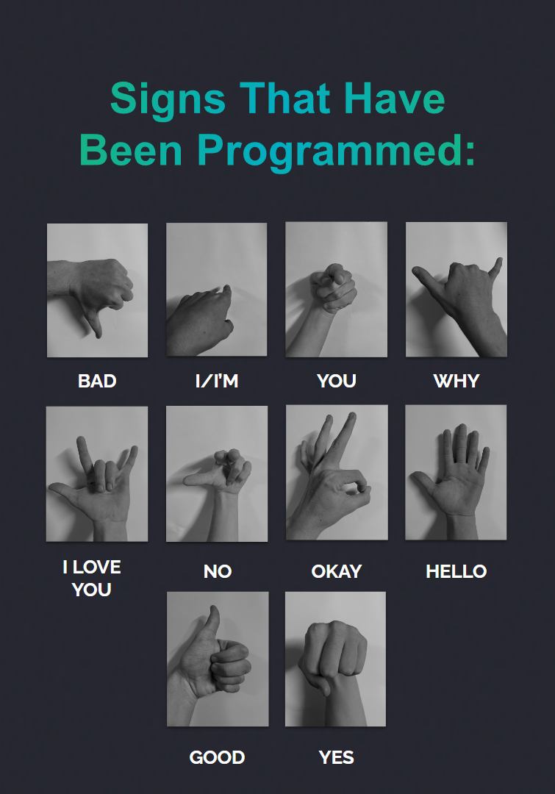

<h1 align="center">
  Handy
   
</h1>

A program to detect sign language hand signs in real-time via the webcam and output the translation of the signs in text and audio form. Accompanying the program will be a user interface designed in Adobe XD that will present what the program will look like to the user. 

  
  &nbsp;&nbsp;&nbsp;&nbsp;
  

## Reddit

<a href="https://www.reddit.com/r/Python/comments/13alyc2/made_a_program_for_year_12_to_detect_sign/">r/Python</a>

## License

Copyright (c) 2023 by [Simon Dwyer](https://github.com/4Tsuki4). Some rights reserved. 
[Handy](https://github.com/4Tsuki4/Handy-Sign-Language-Detection) is licensed under the MIT License as stated in the [LICENSE file](LICENSE).
